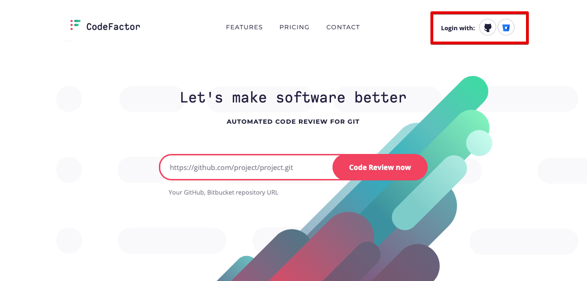
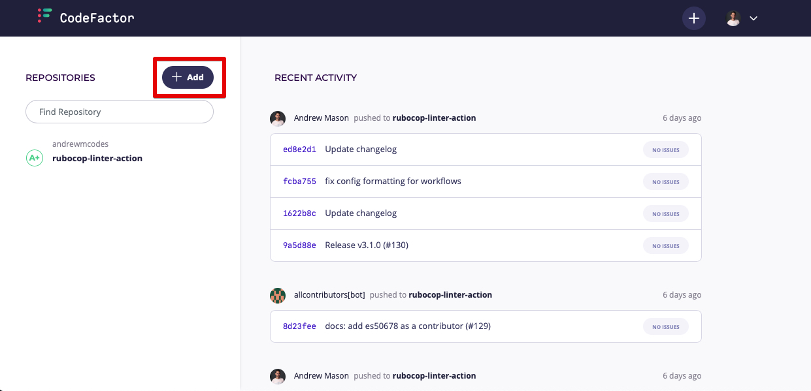
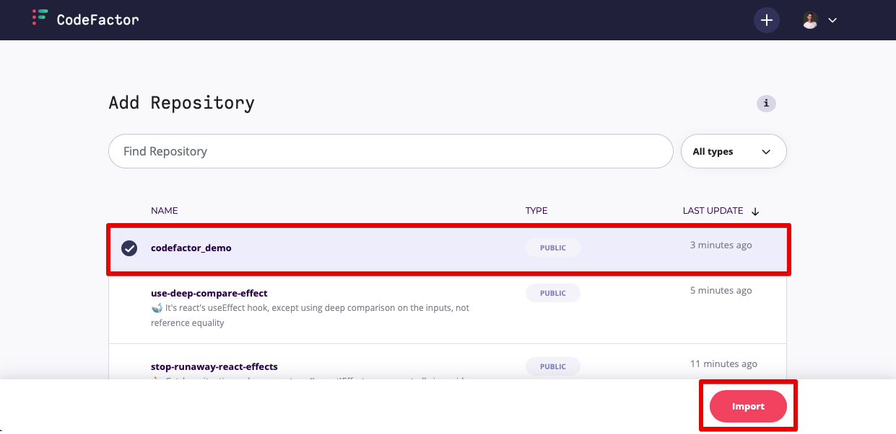
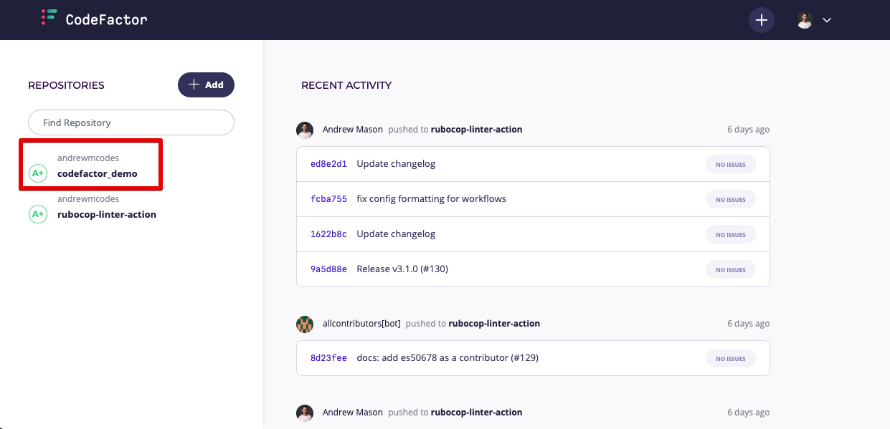
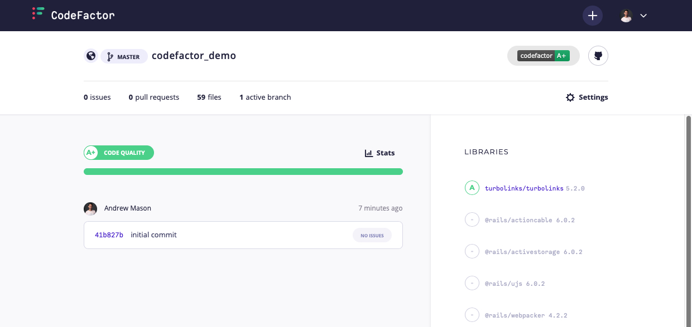
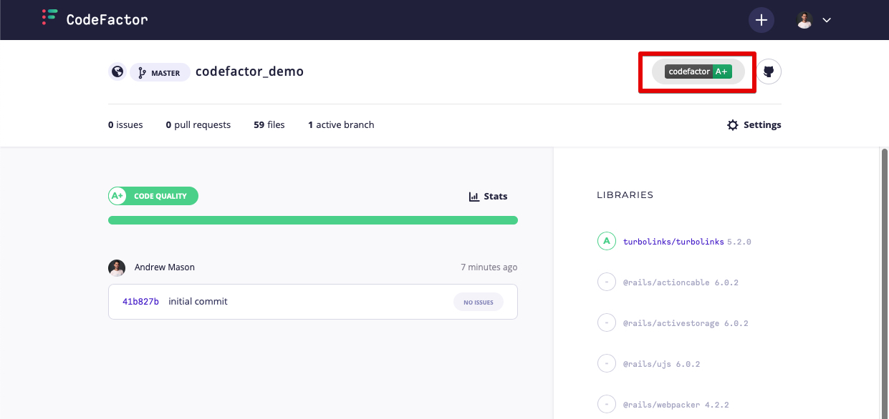

# CodeFactor

## Tutorial

We will be creating a demo app to showcase how to utilize CodeFactor on your projects. The completed code can be found [here](https://github.com/andrewmcodes/codefactor_demo) if you'd like to just look over that.

If you'd like to build it together, let's get started!

### Setup

Let's create a new Rails app and `cd` into it:

```sh
rails new codefactor_demo
cd codefactor_demo
```

### Create Repository

Open GitHub and create a new repository. I named mine `codefactor_demo`.

Open your command line again and let's upstream our code.

```sh
git add .
git commit -m "first commit"
git remote add origin https://github.com/YOUR_USERNAME/codefactor_demo.git
git push -u origin master
```

Your code should now be online in your repo.

### Configuration

Navigate to [codefactor.io](codefactor.io) and login with your preferred method. I chose to use my GitHub account.



Once logged in, you should be taken to your dashboard.

### Test it out

Let's add a new repository. From your CodeFactor dashboard, click `Add`, next to `Repositories`:



You will be taken to a screen that will let you search and select your desired repo. I am adding our demo project repo:



Click the `Import` button to import the repository.

Once your repository has been imported, it will show up on your dashboard:



If we click on our repo, we will be taken to a show page for our repo:



_more on what's on this page_

### README Badge

If we would like to add the CodeFactor README badge to our project, click the badge in the top right corner of the project page:



This will open a modal with a few format options for our badge. I simply copied the markdown code and pasted it on my README.

This badge should update as your code quality changes and be reflected on your README.

## Summary

_summary_

### Helpful links

_links_

Happy coding!
